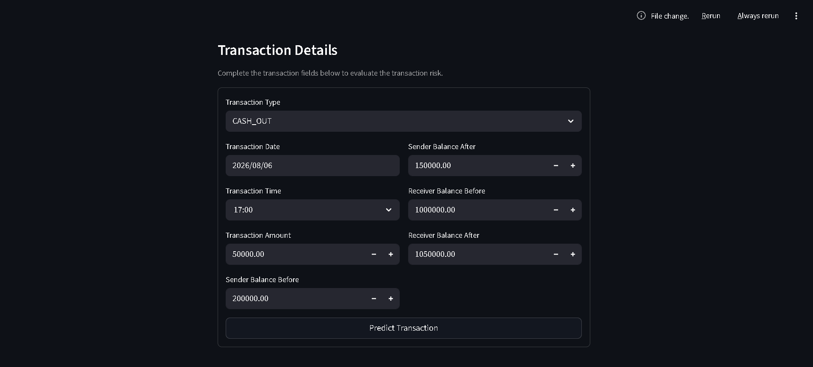
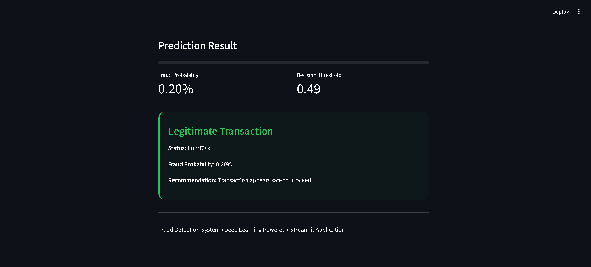
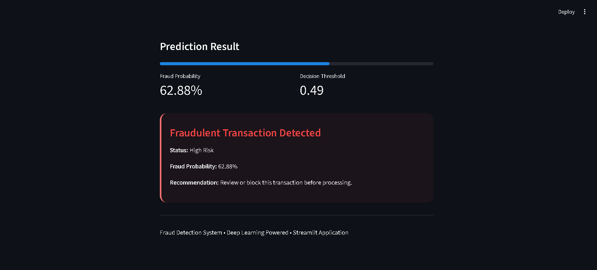

# Transactional Fraud Detection

[](https://www.python.org/)
[](https://streamlit.io/)
[](https://www.tensorflow.org/)
[](https://pytorch.org/)
[](LICENSE)

A complete end-to-end fraud detection project with an interactive Streamlit dashboard, trained model artifacts, and production-ready inference.

## Overview
This repository delivers a ready-to-run fraud scoring system for transaction data. It includes dataset assets, preprocessing pipelines, model artifacts, evaluation summaries, and a Streamlit app for live inference.

## Dataset
This project uses the **PaySim** dataset from Kaggle, which simulates realistic mobile money transactions for fraud detection. The full dataset was used as the source, and a downsampled version was later created for efficient model training and evaluation during development.

## Live Demo
**Try the application:** https://transactional-fraud-detector.onrender.com

## Screenshots

### Transaction Input Form


### Legitimate Transaction Prediction


### Fraud Detection Prediction


## Key Capabilities
- Real-time fraud risk scoring via a Streamlit user interface
- Support for TensorFlow/Keras and PyTorch TabNet model families
- Consistent preprocessing through serialized artifacts
- Built-in `/health` endpoint for monitoring and readiness checks
- Internal public keepalive through configured `SITE_URL`
- SEO-aware endpoints with `robots.txt` and `sitemap.xml`

## Project workflow
The project follows a standard data science workflow from data ingestion to deployment.

```text
Data source (original dataset)
         ↓
Preprocessing and feature engineering
         ↓
Model training and selection
         ↓
Serialized model artifacts and metadata
         ↓
Streamlit application loads model and preprocessing bundle
         ↓
User submits transaction input via web interface
         ↓
Model inference produces fraud risk score
         ↓
Displayed output with transaction risk assessment
```

> Recommended execution sequence for reproducibility:
> 1. `notebooks/preprocessing_pipeline.ipynb`
> 2. `notebooks/model_training.ipynb`
> 3. `notebooks/result_analysis.ipynb`
> 4. `notebooks/model_inference.ipynb`
> 5. `app.py`

## Key Results
The table below summarizes the evaluation metrics for all trained models.

| Model | ROC-AUC | PR-AUC | Fraud F1 | False Positives | False Negatives |
|-------|--------:|-------:|---------:|----------------:|----------------:|
| **MLP (Best)** | **0.9987** | **0.9949** | **0.9686** | **34** | **43** |
| BiLSTM | 0.9975 | 0.9944 | 0.9630 | 43 | 48 |
| GRU | 0.9974 | 0.9938 | 0.9608 | 40 | 56 |
| TabNet | 0.9923 | 0.9667 | 0.8970 | 90 | 157 |
| FT-Transformer | 0.9768 | 0.8963 | 0.8043 | 338 | 176 |
| TabTransformer | 0.9639 | 0.8347 | 0.7504 | 425 | 237 |

The **MLP** model achieved the best overall performance across all evaluated models, with the highest ROC-AUC, PR-AUC, and Fraud F1-score while maintaining the lowest number of false positives and false negatives. It was therefore selected as the final deployment model.
The MLP model is the top performer in this comparison and should be noted as the best-performing candidate for fraud detection within this project.

## Repository structure
- `app.py` — primary Streamlit application and deployment logic
- `data/` — source datasets used for model training and evaluation
- `models/` — serialized model artifacts and metadata
- `artifacts/` — preprocessing bundles and training metadata
- `notebooks/` — model training, preprocessing, and evaluation notebooks
- `results/` — evaluation outputs and prediction results
- `images/` — generated analysis plots and visualization outputs
- `render.yaml` — optional deployment configuration
- `requirements.txt` — Python package dependencies
- `README.md` — repository documentation
- `LICENSE` — license terms
- [`demo/`](demo/) — recorded deployment video demonstrating project execution
- [`documents/`](documents/) — project proposal and final report

## Installation
1. Clone the repository.
   ```bash
   git clone https://github.com/srabonti-codes/Transactional-Fraud-Detection.git
   ```
2. Change directory into the project.
   ```bash
   cd Transactional-Fraud-Detection
   ```
3. Create and activate a Python virtual environment.
4. Install dependencies:
   ```bash
   pip install -r requirements.txt
   ```
5. Run the application:
   ```bash
   streamlit run app.py
   ```

## Limitations
- The model was trained and evaluated using the **PaySim** synthetic transaction dataset, which may not fully capture the complexity and diversity of real-world financial transactions.
- The deployed application performs inference only and does not support continuous online learning or automatic model retraining.
- Fraud predictions are generated from transaction-level features and do not incorporate customer behavioral history, device fingerprints, IP intelligence, or network-based relationships.
- Model performance may decrease when applied to transaction distributions that differ significantly from the training data (data drift).
- The application is intended for research, educational, and demonstration purposes rather than production financial decision-making.

## Future Work
- Evaluate the framework on real-world financial transaction datasets to improve practical applicability.
- Implement automated model retraining and monitoring to address data drift and maintain prediction performance.
- Incorporate graph-based and temporal deep learning models for detecting coordinated fraud patterns.
- Integrate explainable AI (XAI) techniques such as SHAP or LIME to provide interpretable fraud predictions.
- Develop REST API endpoints and database integration for seamless deployment into enterprise fraud detection pipelines.
- Extend the system with real-time streaming inference using technologies such as Apache Kafka or Apache Spark Streaming.
- Investigate advanced transformer-based architectures and ensemble learning methods to further improve fraud detection accuracy.

## License
This repository is distributed under the MIT License. See the [LICENSE](LICENSE) for details.
